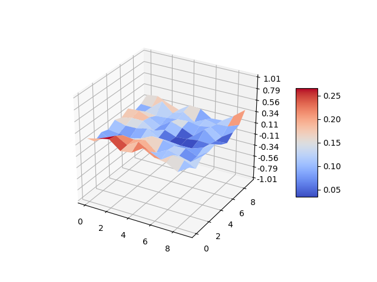
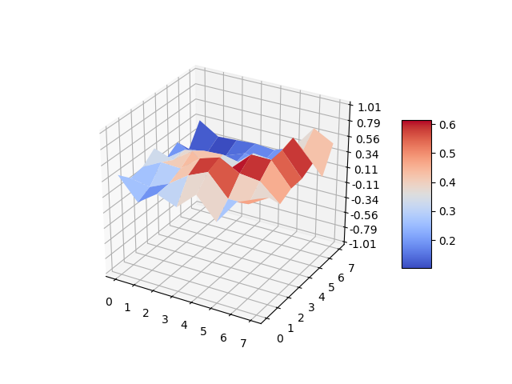

Automatically generates a rough surface such that the sides could be glued together to make a torus.
Change the number of discrete points and the roughness of the terrain by modifying variables at the top of torus.js.

To use:
 nix-shell shell.nix
 node torus.js | python3 visualize.py

This will export an image of the torus called Output/torus.png.

